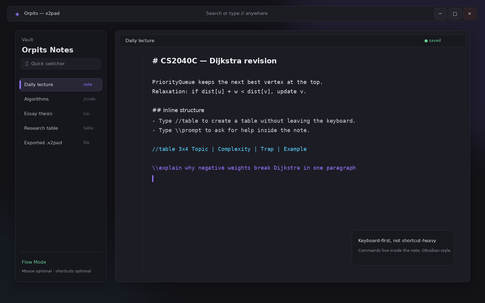
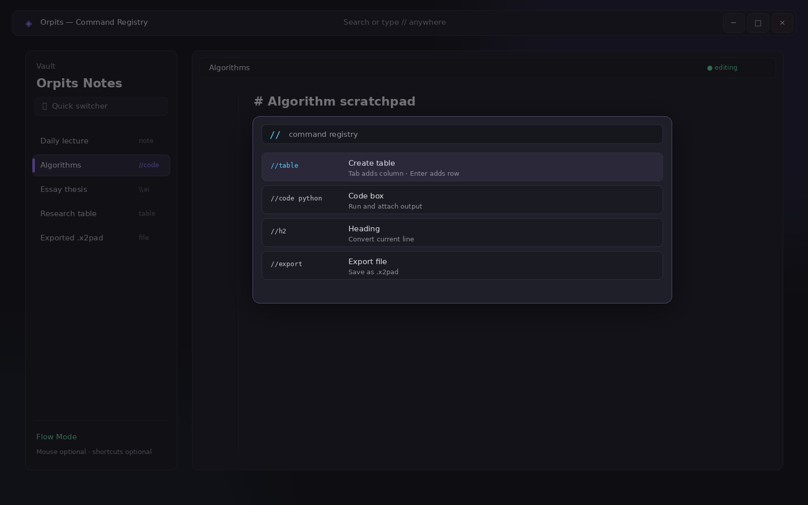
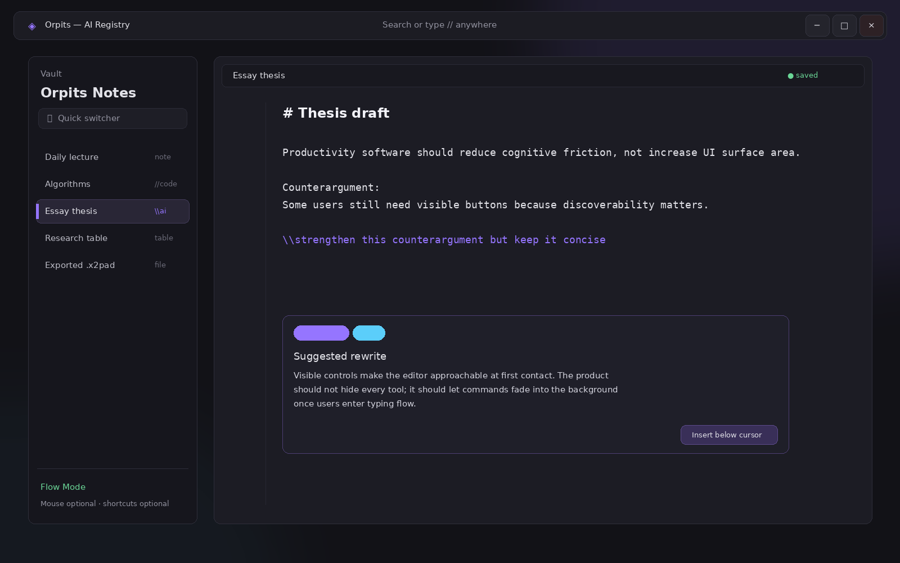
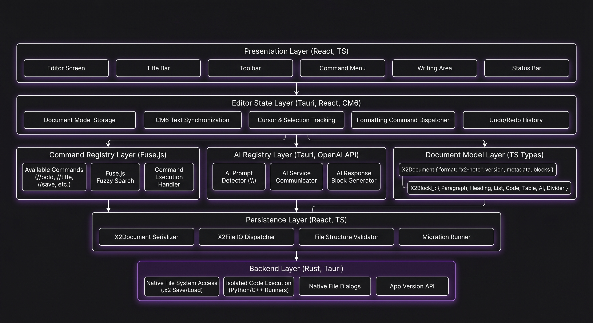

# x2pad
Team Name: 0x02

Proposed Level of Achievement: Apollo 11

Poster: 

Video: 

GitHub Repo: 

App Download: 

# Motivation
Modern note-taking apps often prioritise a "click-heavy" visual interface that disrupts the "flow state" of power users. For developers and students, the constant context-switching between the keyboard and mouse is an ergonomic bottleneck that slows down thought-to-text translation.

# Aim
To build a keyboard-first note-taking editor where structure, computation, and AI assistance can be triggered without leaving the typing flow. By utilizing a "Command-Line Interface (CLI) within a Doc" approach, we hope to provide a seamless experience where structural changes, code execution, and AI assistance are all triggered via the home row. The best part of this would be that it will all be done without the need to memorise any keyboard shortcuts!

# What sets us apart?
Most applications force the user to choose between speed and design, offering either a lightning-fast, keyboard-driven tool burdened by a steep learning curve, or a beautiful, minimalist workspace that requires breaking concentration to navigate click-heavy menus. Furthermore, while traditional productivity apps attempt to solve this with keyboard shortcuts, they disrupt the flow state by relying on rigid memorization of complex key combinations like `Ctrl+Shift+K`. x2pad bridges this gap by introducing a completely friction-free, conversational approach to the document editor. Through its built-in command registry, the application allows users to simply type what they need without their hands ever leaving the home row. 

Ultimately, it delivers the zero-mouse execution speed of an advanced developer tool while entirely removing the cognitive load required to access its features, all wrapped in a polished, translucent interface that feels natively premium.

# User Stories
1. The Focused Student
- As a student taking fast-paced lecture notes, I want to create complex tables using only Tab and Enter so that I can structure information without interrupting my typing flow.
2. The Agile Developer
- As a coder brainstorming logic, I want to type //code to run a snippet and see the output in my notes to verify my ideas immediately
3. The Academic Writer
- As an essay writer, I want to type \\prompt to get instant AI feedback or expansion without leaving my editor.
4. The Privacy Conscious User
- As a user handling sensitive data, I want my notes saved locally in the .x2 format so that I have complete ownership over my files without relying on cloud storage.
5. The UI/UX Enthusiast
- As a user who values aesthetics, I want a minimalist workspace with clean typography, rounded edges, and translucent sidebars so that the editor feels modern and unobtrusive.

# Features
## 1. The Notepad (18 May - 31 May)
This is the foundation of x2pad. It provides users with a clean writing space where they can type notes, format text and build structured documents without needing to switch between keyboard and mouse. 

The main editor is built using CodeMirror 6, which provides a flexible text-editing engine. Instead of relying on a standard HTML text area, CodeMirror allows x2pad to track editor state, cursor position, formatting ranges, and command input more precisely.

## 2. The `//` Registry (1 Jun - 11 Jun)
This is the main interaction system of x2pad. It allows users to perform actions by typing commands directly into the document instead of clicking toolbar buttons or memorising keyboard shortcuts. This supports the main goal of x2pad: keeping users in their typing flow.

The command registry is stored centrally in `src/CommandRegistry.ts`, making it easier to add, update, or remove commands without scattering command logic throughout the application.

### How It Works
When the user types `//`, the editor detects that a command may be starting and opens a command menu. As the user continues typing, the available commands are filtered based on the input.

Eg. typing `//bo` may suggest `//bold`, while typing `//date` can trigger the insertion of the current date.

## 3. The `\\` Registry (12 Jun - 29 Jun)
The `\\` registry is designed to provide AI assistance directly inside the editor. Instead of copying text into a separate chatbot or browser window, users can ask for help while staying inside their notes.

This feature supports use cases such as idea expansion, summarisation, rewriting, explanation and study assistance. The AI workflow is intended to feel like a natural extension of typing, rather than a separate tool.

### How It Works
When the user types `\\` followed by a prompt, x2pad treats the input as an AI request. The prompt is sent to the Gemini API, and the response can be inserted back into the editor.

Eg. `\\summarise this paragraph`
Eg. `\\give me 3 essay points about climate change`
Eg. `\\explain this code in simple terms`

Currently, we require users to input their Gemini API key into the app in order to use this feature. Maybe in the future, we can create a tracking system, allow users to use the AI feature without having their own API key, and then pay at the end of the month. 

## 4. Code Box (1 Jul - 10 Jul)
The code box allows users to write and run code snippets directly inside their notes. This is especially useful for students, developers, and technical users who want to test ideas without leaving the editor. The goal is to make x2pad useful not only for writing, but also for lightweight experimentation.

### How It Works
Users will be able to type the command `//code` to insert a code block into the document. Inside the code box, users can write code with proper formatting and then run it from within the app. 

The backend can handle code execution through the Tauri/Rust layer, which is better suited for interacting with the local system than the frontend alone.

The initial plan is to support Python and C++, with the possibility of adding more languages in the future.

## 5. Tables (11 Jul - 20 Jul)
The table feature is designed to help users structure information quickly without relying on mouse-heavy table editing tools. This is useful for lecture notes, comparison charts, planning, and lightweight calculations. The goal is to make table editing feel natural inside a keyboard-first note-taking environment.

### How It Works
Users will be able to create tables using `//table`. Once a table is created, keyboard actions such as arrow keys, `Tab` and `Enter` can be used to move between cells, add columns or create new rows.

## 6. Fuzzy Search (21 Jul - 27 Jul)
This improves the discoverability of commands. Since x2pad depends heavily on typed commands, users should not need to memorise every command exactly. Fuzzy search allows users to type partial or imperfect command names and still find the command they want.

### How It Works
When the command menu opens, Fuse.js can compare the user's input against the list of available commands. Instead of only matching exact prefixes, it can return close matches.

Eg. typing `//blt` could suggest `//bulletlist`
Eg. typing `//wrd` could suggest `//wordcount`
Eg. typing `//hdr` could suggest `//header`

This makes the command system more forgiving and beginner-friendly.

# Tech Stack

## Frontend

1. React 19
- Used to build the editor interface as reusable UI components, including the editor page, sidebar, toolbar, command menu, and status bar. Its state management is useful for tracking live editor settings such as bold, italic, underline, strikethrough, selected font style, font size, and command menu visibility.

2. TypeScript
- Adds static type checking on top of JavaScript, helping reduce bugs as the command system grows more complex.

3. CodeMirror 6
- Powers the main text editor. Standard text areas cannot support a "CLI within a Doc" experience, so CodeMirror's modular state architecture is essential for detecting specific character sequences like `//` or `\\` in real time without lagging the editor.

4. Fuse.js
- Provides lightweight fuzzy search for the command menu. This ensures that when a user triggers the command menu, the list filters instantaneously, maintaining the "flow state" of a power user.

5. CSS
- Defines the visual design and layout of the application, including the dark editor theme, title bar, toolbar, command menu, editor container, and status bar.

## Backend / Desktop Layer

1. Tauri V2
- Packages x2pad as a lightweight desktop application by relying on the operating system's native webview, resulting in a significantly smaller application size and faster startup times.

2. Rust
- Handles backend logic such as file I/O, saving custom `.x2` files, exporting documents, and process execution. Rust guarantees memory safety without a garbage collector, ensuring the desktop app remains fast and free of memory leaks.

3. Gemini API
- Powers the `\\<prompt>` AI assistant feature. Using an established API allows the engineering focus to remain on complex UX challenges, such as asynchronous streaming and graceful degradation, rather than model hosting.

# Design Ideas

# Current Design

## Main Editor Interface

This screenshot shows the current x2pad editor interface, including the writing area, toolbar and overall dark theme.

## Command Registry

This screenshot shows the command menu appearing after the user types `//`. The menu helps users discover available commands without memorising shortcuts.

# Command Registry
<table>
    <tr>
        <th>Commands Registry:</th>
        <th>Excel Commands:</th>
    </tr>
    <tr>
        <td valign="top">
            <ol>
                <li>//title, //header, //body</li>
                <li>//bold, //italic, //strike, //underline</li>
                <li>//size</li>
                <li>//color</li>
                <li>//bulletlist, //numberlist</li>
                <li>//linebreak</li>
                <li>//code</li>
                <li>//table</li>
                <li>//date, //time</li>
                <li>//wordcount</li>
                <li>//save, //export</li>
            </ol>
        </td>
        <td valign="top">
            <ol>
                <li>//sum()</li>
                <li>//avg(), //mean(), //median()</li>
                <li>//min(), //max()</li>
                <li>//count()</li>
            </ol>
        </td>
    </tr>
</table>

# .x2 Note Format
The `.x2` file format is the local-first storage format used by x2pad. It allows notes to be saved directly to the user's device while preserving the note text and the formatting ranges applied through the editor.

For the current version, `.x2` files are stored as JSON. This makes the format readable, easy to debug, and simple to parse from both the React frontend and the Rust/Tauri backend.

The save process works like this:
1. The user writes normally in the editor and may apply commands such as `//bold`, `//header`, `//color`, or `//size`.
2. The editor stores the note content as text and tracks formatting as style ranges.
3. When the user runs `//save`, the app removes the command text from the editor and sends the note title, content, and style ranges to the Rust/Tauri backend.
4. The backend converts the note into the `.x2` JSON structure and writes it to the user's local device.
5. When the user runs `//open`, the app reads the selected `.x2` file, validates its format and version, reloads the note content, and reapplies the saved style ranges in the editor.

The current `.x2` file includes:
- `format`: Identifies the file as an x2pad note file.
- `version`: Tracks the file format version so future versions can remain compatible.
- `title`: Stores the note title.
- `content`: Stores the note text as a single string.
- `styles`: Stores formatting ranges such as font size, color, bold, italic, strikethrough, and underline.
- `savedAt`: Stores the timestamp for when the note was last saved.

This gives the app a working persistence layer for the current editor features. In future versions, the `.x2` format can be expanded to support richer structured blocks for tables, code boxes, AI-generated content, and additional metadata.

# Architecture

x2pad is built as a desktop application using Tauri, React, TypeScript, CodeMirror, and Rust. The application is split into two main layers: the frontend editor layer and the backend desktop layer.

The frontend layer is responsible for the user interface, editor behaviour, command detection, and visual feedback. The backend layer is responsible for desktop-specific operations such as saving files, opening files, exporting documents, and running system-level tasks.

This separation allows x2pad to feel like a modern web-based editor while still having access to native desktop features.

## 1. Frontend Responsibilities
The frontend is built using React, TypeScript, CodeMirror 6, Fuse.js, and CSS. It is responsible for everything the user directly interacts with inside the editor.

The frontend handles:
- Rendering the main editor interface
- Displaying the toolbar, sidebar, command menu, and status bar
- Managing editor state such as text content, cursor position, and formatting
- Detecting typed commands such as `//bold`, `//save`, and `\\<prompt>`
- Filtering command suggestions as the user types
- Applying visual formatting such as bold, italic, underline, strikethrough, font size, and color
- Sending save, export, and AI requests to the backend when needed

CodeMirror 6 is especially important because it gives x2pad more control than a normal text area. It allows the app to track document changes, command triggers, and formatting behaviour in a more structured way.

React is used to organise the interface into reusable components, while TypeScript helps keep the command and editor logic safer as the app becomes more complex.

## 2. Rust/Tauri Backend Responsibilities
The backend is built using Rust through the Tauri framework. It acts as the bridge between the frontend editor and the user's operating system.

The backend handles:
- Saving notes as `.x2` files
- Opening existing `.x2` files
- Exporting notes to other formats such as PDF
- Accessing the local file system
- Running local processes for future code execution features
- Handling backend operations that should not be done directly in the frontend

Tauri allows the app to use the operating system's native webview instead of bundling a full browser engine. This helps keep the application smaller and faster than many Electron-based desktop apps.

Rust is used because it is fast, memory-safe, and suitable for low-level desktop operations such as file handling and process execution.

## 3. How Commands Flow Through the App
The command system is one of the most important parts of x2pad. It allows users to control the editor by typing commands directly into the document.

A typical `//` command flow works like this:
1. The user types `//` in the editor.
2. The frontend detects that the user may be entering a command.
3. The command menu appears and displays matching commands.
4. As the user continues typing, the command list is filtered.
5. The user selects or completes a command such as `//bold`.
6. The editor checks the command against the central command registry.
7. The command is executed.
8. The command text is removed from the document.
9. The editor updates the document state or formatting.

Eg. when the user types `//bold`, x2pad recognises the command, removes `//bold` from the editor, and enables bold formatting for the next text the user types.

This design keeps the user in the typing flow because they do not need to stop and search through menus or memorise complex keyboard shortcuts.

## 4. How Saving and Loading Works
x2pad uses a local-first saving system based on the `.x2` file format. This allows users to store their notes directly on their own device.

The save flow works like this:
1. The user types `//save`.
2. The frontend recognises the save command.
3. The editor collects the note title, text content, and formatting ranges.
4. The frontend sends this data to the Rust/Tauri backend.
5. The backend converts the note into the `.x2` JSON structure.
6. The backend writes the `.x2` file to the user's local file system.
7. The editor can show feedback that the note has been saved.

The loading flow works like this:
1. The user opens an existing `.x2` file.
2. The Rust/Tauri backend reads the file from the local file system.
3. The backend validates that the file is a supported x2pad note.
4. The note content and style ranges are sent back to the frontend.
5. The frontend reloads the text into CodeMirror.
6. The saved formatting is reapplied inside the editor.

This system allows x2pad to preserve both the user's writing and the formatting applied through typed commands.

## 5. How AI Requests Are Handled
The `\\` AI registry is designed to let users request AI assistance without leaving the editor. Unlike a simple chatbot prompt, x2pad can send the user's prompt together with document context so that the AI response is aware of what the user is currently working on.

A typical AI request flow works like this:
1. The user types a prompt using the `\\` command.
2. The frontend detects that the input is an AI request.
3. The prompt text is extracted from the editor.
4. The frontend collects additional context from the note, such as the active line, nearby paragraph, document headings, and full document text.
5. The app sends the prompt and document context to the AI service.
6. The AI service returns a response that is more relevant to the current note.
7. The response is prepared for insertion back into the editor.
8. The user can accept the response and continue writing without switching applications.

Eg. a user may type: `\\summarise this paragraph`

x2pad can send the prompt together with the current note context to the Gemini API, allowing the generated response to better match the user's existing document.

In future versions, the AI flow can be improved with loading states, streamed responses, error handling, and options for where the AI response should be inserted. For privacy, the app should also make it clear when text or document context is being sent to an external AI service.

## 6. Why This Architecture Fits x2pad
This architecture fits x2pad because the app needs both a flexible editor interface and native desktop capabilities.

The frontend is responsible for delivering a smooth writing experience, while the Rust/Tauri backend handles operations that require access to the local system. This separation keeps the editor responsive while still allowing features such as local file saving, exporting, and future code execution.

By combining React, CodeMirror, Tauri, and Rust, x2pad can provide the feel of a modern web editor while behaving like a lightweight desktop application.

# Current Milestone Objectives
For the current milestone, our main objective is to complete the core `//` command registry and begin building the `\\` AI registry

The milestone objectives are:
- Complete the core `//` command registry
- Improve the command menu so it filters commands as the user types (not exactly the fuzzy search feature yet)
- Add note persistence, including saving and loading `.x2` files
- Refine the editor UI based on prototype testing and user feedback

# Current Milestone Progress
In this milestone, we completed a usable version of the editor interface. The editor supports continuous typing in a CodeMirror-based writing area, and users can apply formatting or insert content through typed commands from the command registry. The current implemented `//` commands include:
- `//title` to switch to title-sized text
- `//header` to switch to header-sized text
- `//body` to return to body-sized text
- `//bold` to enable bold text
- `//italic` to enable italic text
- `//strike` to enable strikethrough text
- `//underline` to enable underlined text
- `//default` to reset text formatting
- `//size` to adjust the text size
- `//color` to change the text color
- `//bulletlist` to add bullet points
- `//numberlist` to start a numbered list
- `//date` to add the date
- `//time` to add the time
- `//wordcount` to insert the current word count
- `//save` to save the document in .x2 format
- `//export` to export the document in PDF format

The command menu also filters available commands as the user types, making the keyboard-first workflow easier to discover.

We also worked on the first usable version of the AI engine, using the `\\` command.

# Software Engineering Evidence
1. Modular frontend structure
- The project separates pages, components, styles, and command logic into different files. This makes the editor easier to maintain as more features are added.
2. Central command registry
- Keyboard commands are stored in `src/CommandRegistry.ts` instead of being hardcoded throughout the editor. This makes it easier to add, test, and update commands such as `//table`, `//code`, and future AI prompts.
3. Incremental feature delivery
- The project is split into milestones and features. We are building the editor foundation first, then adding commands, AI, code boxes, tables, and fuzzy search in later stages.

# Next Milestone Objectives
For the next milestone, we plan to implement the `//code` and `//table` features.

The next milestone objectives are:
- Implement a fully functional `//table` command
- Add table formulas such as SUM, AVERAGE, MIN, MAX, and COUNT
- Implement a fully functional `//code` command
- Add code boxes that can run at least Python and C++ snippets

# Challenges Faced
1. Balancing keyboard-first design with discoverability
- A command-based editor is fast for experienced users, but new users still need clear suggestions so they do not have to memorise every command.
2. Managing editor state correctly
- Formatting commands need to affect newly typed text without unexpectedly changing existing text. This requires careful handling of editor state, cursor position, and text decorations.
3. Avoiding conflicts between normal typing and commands
- Since commands are typed directly into the document, the editor must distinguish between normal text and intentional commands like `//bold` or `//code`.

# User Testing and Validation

## Testing Done So Far

### 1. Command Registry Testing
We tested the `//` command registry to check that commands produce the expected editor behaviour and do not accidentally affect unrelated text.

Test scenarios included:
- Typing `//bold` to enable bold formatting for newly typed text
- Typing `//date` to insert the current date
- Typing `//wordcount` to return the current word count
- Typing invalid commands that are not in the command registry
- Checking that executed commands are removed from the editor after they run

From these tests, we checked whether:
- Commands executed correctly
- Invalid commands were ignored safely
- The command menu behaved predictably
- Command text was removed after execution
- The editor remained usable after commands were run

This is important because the command registry is the core interaction model of x2pad. If commands behave inconsistently, the keyboard-first workflow becomes unreliable.

### 2. `.x2` File Persistence Testing
We tested whether notes can be saved and reopened correctly using the `.x2` file format.

Test scenarios included:
- Saving a note with plain text and reopening it
- Saving a note with formatting such as bold, italic, underline, strikethrough, color, and font size changes
- Checking that saved files preserve the note title, content, style ranges, and timestamp
- Saving multiple notes and confirming that each file can be opened independently
- Opening invalid or unexpected files to check that the app handles them gracefully

From these tests, we checked whether:
- Notes were saved successfully
- Saved content could be loaded back into the editor
- Formatting information was preserved where supported
- Invalid files did not crash the app
- Local-first storage behaved reliably

This ensures that users do not lose their work and that x2pad's local file format can support the current editor features.

### 3. Cross-Feature Integration Testing
We tested whether different editor features work correctly together, instead of only testing each feature in isolation.

Test scenarios included:
- Applying formatting, saving the file, reopening it, and checking that the content is still present
- Using multiple commands in the same document without conflicts
- Inserting date, time, word count, and formatting commands in one note
- Exporting a saved note and checking that the exported output matches the editor content
- Combining AI-generated text with manually written notes

From these tests, we checked whether:
- Features continued to work when used together
- One command did not break another command
- Saved and exported content matched the editor state
- The writing workflow remained smooth across multiple actions

This helps ensure that x2pad works as a complete editor, not just as a set of isolated features.

### 4. Stress Testing
We tested the editor with larger amounts of text to check whether the app remains responsive during normal writing and editing.

The purpose of this test was to ensure that x2pad can handle longer notes without noticeable input lag, since students and developers may write long documents during lectures, study sessions, or project planning.

Test scenarios included:
- Typing continuously in the editor
- Pasting longer blocks of text into the editor
- Using formatting commands after the document becomes longer
- Opening the command menu after the document contains more content
- Saving and reopening larger `.x2` files
- Repeatedly applying formatting commands to check that the editor remains responsive

From these tests, we checked whether:
- Typing remained smooth
- The command menu still appeared quickly
- Formatting commands still worked correctly
- The editor did not freeze or crash

This ensures that x2pad remains smooth enough for real note-taking, long-form writing, and heavier usage.

### 5. Edge-Case Input Testing
We also tested unusual input cases to ensure that typed commands do not accidentally interfere with normal writing.

The purpose of this test was to check whether x2pad can distinguish between normal text and intentional commands, since commands are typed directly into the document.

Test scenarios included:
- Typing `//` without completing a command
- Typing incomplete commands such as `//bo` or `//col`
- Typing invalid commands that are not in the command registry
- Typing command-like text as part of normal notes
- Pasting text that contains `//` or `\\`
- Using special characters and symbols in the editor
- Using command-like text inside future code boxes without triggering editor commands accidentally

From these tests, we checked whether:
- Invalid commands were ignored safely
- The editor did not crash
- Normal writing was not accidentally deleted
- The command menu behaved predictably
- Users could continue typing after an incomplete or invalid command

### 6. AI Feature Testing
We tested the `\\` AI registry to check whether AI prompts can be triggered from inside the editor and handled without breaking the writing flow.

Test scenarios included:
- Submitting a normal writing prompt and checking that a response appears
- Submitting an empty or incomplete prompt
- Handling slow AI responses with a visible waiting state
- Handling failed AI requests without crashing the editor
- Confirming that AI-generated content can be inserted into the correct location in the document

From these tests, we checked whether:
- The AI command was detected correctly
- The editor collected the prompt and document context properly
- The app handled missing or invalid Gemini API key situations
- AI responses could be accepted, moved, or cancelled without disrupting the note
- The user could continue writing after the AI interaction

This ensures that the AI feature supports the writing flow without making the editor unreliable.

## Planned User Testing for Next Milestone
For the next milestone, we plan to distribute x2pad to a small group of friends and classmates for pilot testing. This will help us evaluate the app in more realistic note-taking situations.

The goal of this user testing is to find out whether the keyboard-first workflow is actually intuitive for new users, not just for the development team.

We plan to ask testers to complete tasks such as:
- Create a new note
- Apply formatting using `//bold`, `//header`, and `//color`
- Insert the date or time using a command
- Save the note as a `.x2` file
- Export the note as a PDF
- Try the `\\` AI prompt feature if available
- Give feedback on whether the command menu is easy to understand

We will collect feedback on:
- Ease of learning the command system
- Whether users prefer typing commands over clicking buttons
- Whether the command menu helps with discoverability
- Any confusing or unexpected behaviour
- Any bugs, crashes, or performance issues
- Suggestions for future commands or interface improvements

This feedback will help us decide what to improve before implementing larger features such as tables, code boxes, and full fuzzy search.

# Note
For the current state of our app, only the Windows version is available. However, for our final product, we would like to create a Mac version as well.
