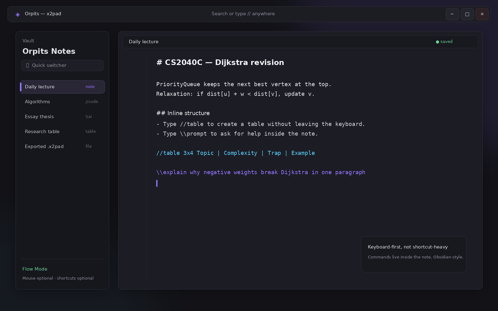
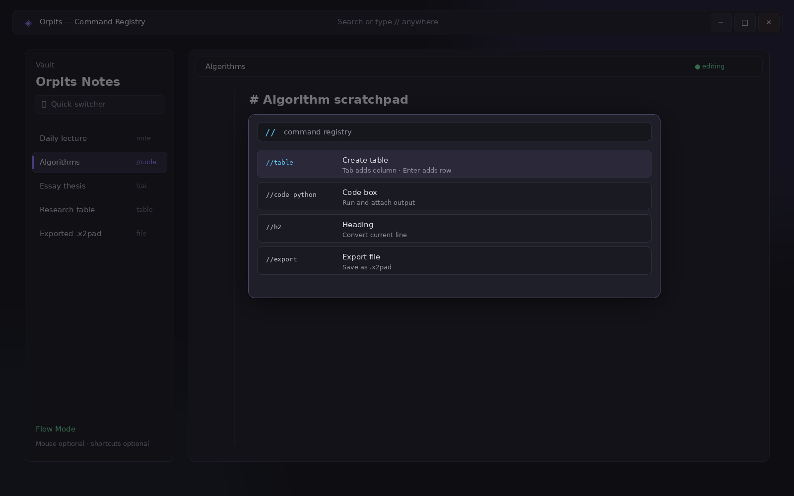
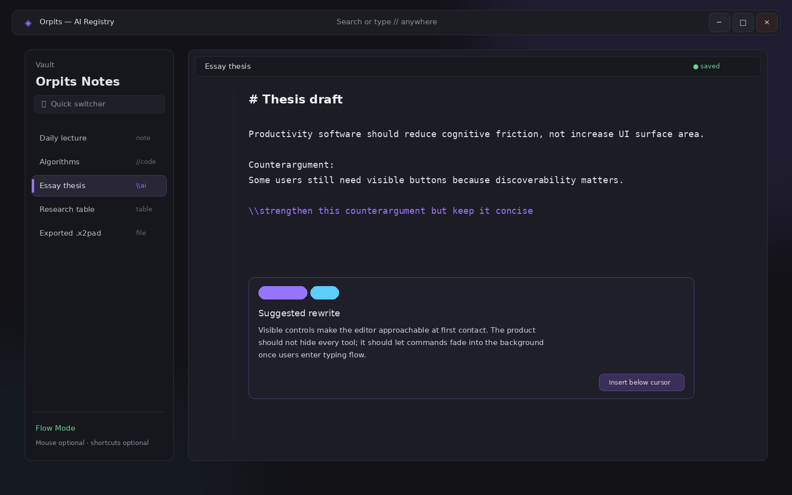
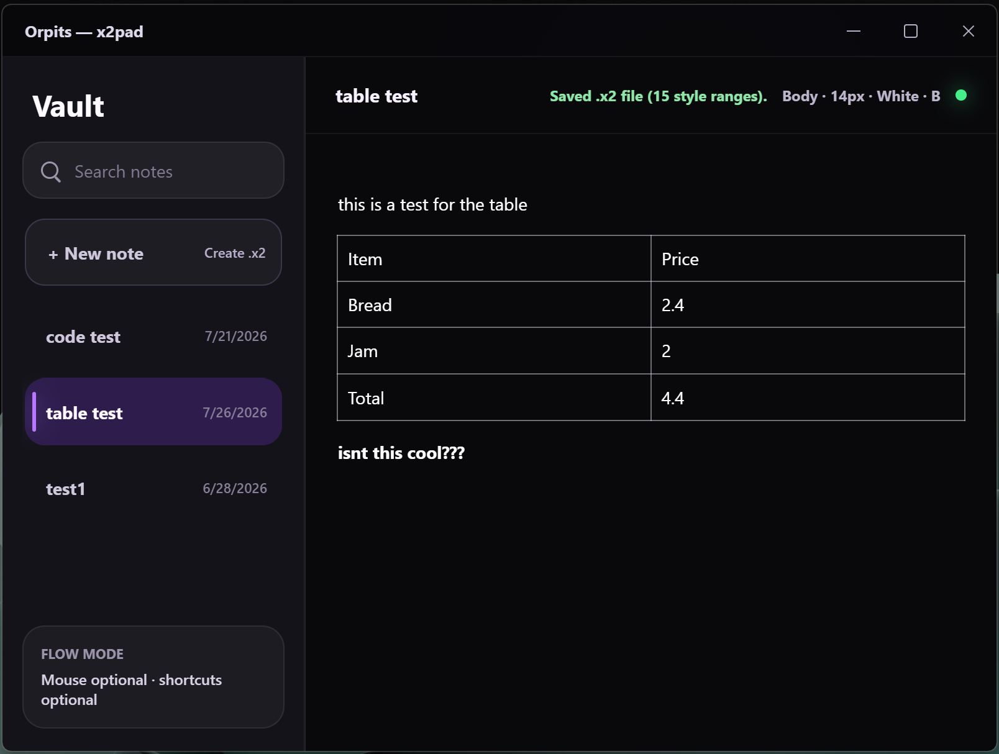
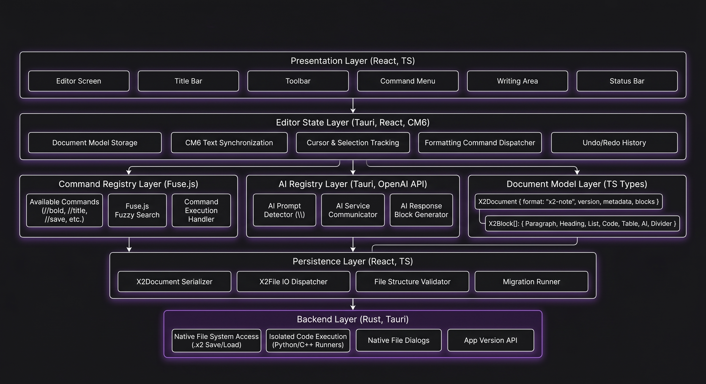

# x2pad
Team Name: 0x02

Proposed Level of Achievement: Apollo 11

Poster: https://drive.google.com/file/d/1VN_jcvvfEWkB6IHPJKemCIk_EEEjQR7I/view?usp=drive_link

Video: https://drive.google.com/file/d/1j2gtdw9_rOJNpFGhwHD4IRMjx4EUHTAt/view?usp=drive_link

App Download: https://drive.google.com/file/d/13d55TByjsLx1_P4X6ghkMNUxHNb1Sr73/view?usp=drive_link

User Guide: https://drive.google.com/file/d/1Lk3EA71SZVaiWFZ8eVLZcgR5WA8SdFdn/view?usp=drive_link

# Motivation
Modern note-taking apps often prioritise a "click-heavy" visual interface that disrupts the "flow state" of power users. For developers and students, the constant context-switching between the keyboard and mouse is an ergonomic bottleneck that slows down thought-to-text translation.

# Aim
To build a keyboard-first note-taking editor where structure, computation, and AI assistance can be triggered without leaving the typing flow. By utilizing a "Command-Line Interface (CLI) within a Doc" approach, we hope to provide a seamless experience where common document actions can be triggered by typed commands. This reduces the need to memorise traditional formatting shortcuts, while specialised features such as code execution and table editing still use a small set of keyboard controls.

# What sets us apart?
Most applications force the user to choose between speed and design, offering either a lightning-fast, keyboard-driven tool burdened by a steep learning curve, or a beautiful, minimalist workspace that requires breaking concentration to navigate click-heavy menus. Furthermore, while traditional productivity apps attempt to solve this with keyboard shortcuts, they disrupt the flow state by relying on rigid memorization of complex key combinations like `Ctrl+Shift+K`. x2pad bridges this gap by introducing a conversational approach to the document editor. Through its built-in command registry, the application allows users to type many common actions directly into their notes.

Ultimately, it provides a mouse-optional core editing workflow that reduces the cognitive load required to access common features, all wrapped in a polished, translucent interface that feels natively premium. Initial setup, file selection, and some application controls can still use standard desktop dialogs and mouse input.

# User Stories
1. The Focused Student
- As a student taking fast-paced lecture notes, I want to create complex tables using only Tab and Enter so that I can structure information without interrupting my typing flow.
2. The Agile Developer
- As a coder brainstorming logic, I want to type `//code` to insert a code box, run the snippet with `Ctrl+Enter`, and see the output in my notes so that I can verify my ideas immediately.
3. The Academic Writer
- As an essay writer, I want to type `\\prompt` to get instant AI feedback or expansion without leaving my editor.
4. The Privacy Conscious User
- As a user handling sensitive data, I want my notes saved locally in the `.x2` format so that I have complete ownership over my files without relying on cloud storage.
5. The UI/UX Enthusiast
- As a user who values aesthetics, I want a minimalist workspace with clean typography, rounded edges, and translucent sidebars so that the editor feels modern and unobtrusive.

# Features
## 1. The Notepad
This is the foundation of x2pad. It provides users with a clean writing space where they can type notes, format text and build structured documents without needing to switch between keyboard and mouse. 

The main editor is built using CodeMirror 6, which provides a flexible text-editing engine. Instead of relying on a standard HTML text area, CodeMirror allows x2pad to track editor state, cursor position, formatting ranges, and command input more precisely.

## 2. The `//` Registry
This is the main interaction system of x2pad. It allows users to perform actions by typing commands directly into the document instead of clicking toolbar buttons or memorising keyboard shortcuts. This supports the main goal of x2pad: keeping users in their typing flow.

The command registry is stored centrally in `src/CommandRegistry.ts`, making it easier to add, update, or remove commands without scattering command logic throughout the application.

### How It Works
When the user types `//`, the editor detects that a command may be starting and opens a command menu. As the user continues typing, the available commands are filtered based on the input.

Eg. typing `//bo` may suggest `//bold`, while typing `//date` can trigger the insertion of the current date.

## 3. The `\\` Registry
The `\\` registry is designed to provide AI assistance directly inside the editor. Instead of copying text into a separate chatbot or browser window, users can ask for help while staying inside their notes.

This feature supports use cases such as idea expansion, summarisation, rewriting, explanation and study assistance. The AI workflow is intended to feel like a natural extension of typing, rather than a separate tool.

### How It Works
When the user types `\\` followed by a prompt, x2pad treats the input as an AI request. The prompt is sent to the Gemini API, and the response can be inserted back into the editor.

Eg. `\\summarise this paragraph`

Eg. `\\give me 3 essay points about climate change`

Eg. `\\explain this code in simple terms`

When the Gemini feature is used, x2pad sends the prompt together with document context, including the active line, nearby paragraph, headings, and full note text, to the Gemini API. Normal note-taking and local `.x2` storage do not require sending note content to an external service.

Currently, we require users to input their Gemini API key into the app in order to use this feature. Maybe in the future, we can create a tracking system, allow users to use the AI feature without having their own API key, and then pay at the end of the month. 

## 4. Code Box
The code box allows users to write and run code snippets directly inside their notes. This is especially useful for students, developers, and technical users who want to test ideas without leaving the editor. The goal is to make x2pad useful not only for writing, but also for lightweight experimentation.

### How It Works
Users can type `//code` to insert a Python code box into the document. The code box provides Python syntax highlighting and keeps the source code as part of the note. Users can enter and leave the box using the keyboard, then press `Ctrl+Enter` to run the snippet.

The output panel below the code box displays standard output, error output, and the result of the execution. The React frontend manages the editing experience and sends the Python source to the Tauri/Rust backend, which runs it using a locally installed Python interpreter.

The current implementation supports Python. C++ and other languages may be added in future versions.

## 5. Tables
The table feature is designed to help users structure information quickly without relying on mouse-heavy table editing tools. This is useful for lecture notes, comparison charts, planning, and lightweight calculations. The goal is to make table editing feel natural inside a keyboard-first note-taking environment.

### How It Works
Users can type `//table` to create a blank 1×1 table. The first cell opens immediately in editing mode so the user can begin typing without another command. Tables use three keyboard-operated interaction layers:

1. **Document layer:** The whole table is outlined when the document cursor reaches it. Pressing `Enter` opens the table layer, the arrow keys move past the table, and `Backspace` deletes the entire selected table.
2. **Table layer:** One cell is highlighted without placing a text cursor inside it. The arrow keys move the cell selection, `Enter` opens the selected cell for editing, and `Escape` returns to the document layer.
3. **Cell layer:** The selected cell remains highlighted and contains the text cursor. `Escape` returns to the table layer, while cursor movement is kept inside the active cell.

While editing a cell, `Tab` moves to the next column and adds a column when the cell is already at the right edge. `Enter` moves to the next row and adds a row when the cell is already on the bottom edge. `Shift+Tab` always inserts a column to the right of the current cell, and `Shift+Enter` always inserts a row below it. These two insertion shortcuts also work from the table layer and keep the newly created cell selected.

In the table layer, tapping `Shift` cycles the selection from the current cell, to its entire row, to its entire column, and then back to the cell. Pressing `Backspace` while a row or column is selected deletes that row or column. A table always retains at least one row and one column.

Tables also support calculations over spreadsheet-style cell ranges. For example, entering `//sum(A1:A3)` inside a table cell and pressing `Enter` replaces the formula with the calculated result. The supported operations are `sum`, `avg`, `mean`, `min`, `max`, and `count`.

## 6. Fuzzy Search (27 Jul - 31 Jul)
This planned feature will improve the discoverability of commands. Since x2pad depends heavily on typed commands, users should not need to memorise every command exactly. Fuzzy search will allow users to type partial or imperfect command names and still find the command they want.

### How It Works
When implemented, Fuse.js will compare the user's input against the list of available commands. Instead of only matching exact prefixes, it will be able to return close matches.

Eg. typing `//blt` could suggest `//bulletlist`

Eg. typing `//wrd` could suggest `//wordcount`

Eg. typing `//hdr` could suggest `//header`

This will make the command system more forgiving and beginner-friendly.

# Tech Stack

## Frontend

1. React 19
- Used to build the editor interface as reusable UI components, including the editor page, sidebar, toolbar, command menu, and status bar. Its state management is useful for tracking live editor settings such as bold, italic, underline, strikethrough, selected font style, font size, and command menu visibility.

2. TypeScript
- Adds static type checking on top of JavaScript, helping reduce bugs as the command system grows more complex.

3. CodeMirror 6
- Powers the main text editor. CodeMirror's modular state architecture provides the document tracking, decorations, language support, and keymaps needed to detect character sequences such as `//` or `\\` and render interactive editor features.

4. Fuse.js (planned)
- Planned for lightweight fuzzy search in the command menu. The current command menu filters commands as the user types, while Fuse.js is intended for the later fuzzy search feature so users can still find commands even when they type imperfect abbreviations.

5. CSS
- Defines the visual design and layout of the application, including the dark editor theme, title bar, toolbar, command menu, editor container, and status bar.

## Backend / Desktop Layer

1. Tauri V2
- Packages x2pad as a desktop application that relies on the operating system's native webview instead of bundling a separate browser engine. This supports the project's goal of keeping the application lightweight.

2. Rust
- Handles backend logic such as file I/O, saving custom `.x2` files, exporting documents, and process execution. Rust provides strong memory-safety guarantees without requiring a garbage collector and is well suited to native desktop operations.

3. Gemini API
- Powers the `\\<prompt>` AI assistant feature. Using an established API allows the engineering focus to remain on document-aware requests, asynchronous request handling, insertion controls, and graceful error states rather than model hosting.

# Design Ideas




# Current Design

## Main Editor Interface

This screenshot shows the current x2pad editor interface, including the writing area, toolbar and overall dark theme.

## Command Menu Screenshot

This screenshot shows the command menu appearing after the user types `//`. The menu helps users discover available commands without memorising shortcuts.

## AI Registry

This screenshot shows the user typing an AI prompt with the `\\` command. The prompt is highlighted in green to distinguish it from normal note content.

This screenshot shows the AI status panel while x2pad is reading the note context and generating a response.

This screenshot shows the AI response ready state. The user can press `Tab` to switch between insertion positions, `Enter` to insert the response, or `Esc` to cancel.

## Code Box

This screenshot shows a Python code box inside a note. Users can write syntax-highlighted Python code in the upper section and press `Ctrl+Enter` to run it. The output panel below displays the execution status, exit code, and program output.

## Table

This screenshot shows a table rendered directly inside a note. The example contains item and price columns, with a final row displaying the calculated total.

# Command Registry
<table>
    <tr>
        <th>Command Registry:</th>
        <th>Table Formulas:</th>
    </tr>
    <tr>
        <td valign="top">
            <ol>
                <li>//title, //header, //body</li>
                <li>//bold, //italic, //strike, //underline</li>
                <li>//default</li>
                <li>//size</li>
                <li>//color</li>
                <li>//bulletlist, //numberlist</li>
                <li>//code</li>
                <li>//table</li>
                <li>//date, //time</li>
                <li>//wordcount</li>
                <li>//new, //open</li>
                <li>//save, //export</li>
            </ol>
        </td>
        <td valign="top">
            <ol>
                <li>//sum(A1:C3)</li>
                <li>//avg(A1:C3), //mean(A1:C3)</li>
                <li>//min(A1:C3), //max(A1:C3)</li>
                <li>//count(A1:C3)</li>
            </ol>
        </td>
    </tr>
</table>

The command registry exists so that x2pad does not need to hardcode every command directly inside the editor logic. If every command was handled with separate `if` statements or scattered event handlers, the editor would become harder to maintain as more commands are added.

Instead, commands are stored as structured entries in `src/CommandRegistry.ts`. Each command can define:
- a `name`, such as `bold`, `color`, or `wordcount`;
- a `description`, which can be shown in the command menu;
- optional `arguments`, such as the supported values for `//color`;
- an `action`, which performs the command.

This design makes the command system easier to extend. A basic formatting or insertion command can be added by adding a new registry entry, while the surrounding command menu and execution flow can remain mostly unchanged.

For example, `//date`, `//time`, and `//wordcount` all use the same command detection and execution pathway even though they produce different output. The editor only needs to detect that a command was typed, find the matching registry entry, run its action, and remove the command text from the document.

The registry also improves discoverability. Since every command has a description, the same data structure that powers command execution can also power the command menu. This avoids duplicating command names and descriptions in separate parts of the codebase.

The registry also supports more advanced commands. `//table` and `//code` use the same discovery and selection pathway as other commands, while their specialised editor behaviour is handled separately.

# .x2 Note Format
The `.x2` file format is the local-first storage format used by x2pad. It allows notes to be saved directly to the user's device while preserving the note text and the formatting ranges applied through the editor.

This section focuses on what is stored inside the `.x2` file. The full save and loading flow is explained later in the Architecture section.

## Why JSON
`.x2` files use JSON because the current note data consists mainly of structured text and metadata. JSON is readable without special tools, easy to inspect during development, and structured enough for validation and future extension. A binary format might be smaller, but would be harder to debug.

Another reason for choosing JSON is compatibility with the frontend and backend stack. The editor state already exists in TypeScript as objects such as the note title, content, style ranges, and structured tables. The Rust backend can serialise and deserialise the same structure using `serde`. This reduces unnecessary conversion work between the frontend and backend.

## Why `.x2` Stores Plain Text Plus Style Ranges
x2pad stores the main note content as plain text and stores formatting separately as style ranges. This is a deliberate alternative to storing the whole note as HTML.

Structured tables are the exception: the plain-text content stores a table anchor, while the table's cells and formatting are stored in the separate `tables` field.

Using plain text plus style ranges has several benefits:
- the note content remains easy to read and process;
- commands can operate on text without needing to parse HTML;
- saving and loading is easier to debug;
- style information can be reapplied by CodeMirror decorations;
- PDF export can transform the same style ranges into styled PDF text;
- future export systems can decide how to represent the styles.

If x2pad stored notes directly as HTML, formatting might be easier at first, but the data format would become more tightly coupled to the current UI representation. It would also make features like command parsing, code boxes, and table formulas harder to manage cleanly because the app would need to work around HTML tags mixed into the note content.

The current approach separates content from presentation. The `content` field stores what the user wrote, while the `styles` field stores how selected ranges should appear. This keeps the meaning of the note independent from how it is displayed on screen.

## Why Local Files Instead of a Database for Notes
x2pad uses local `.x2` files instead of storing normal notes in a database. This was a deliberate design choice based on the target users, the privacy-focused user story, and the current scope of the project.

For normal note-taking, local files are a better fit because:
- users keep direct ownership of their notes;
- the app can work without account creation;
- the app can work without cloud infrastructure;
- each note can be backed up, copied, moved, or shared like a normal file;
- the file remains inspectable because it is stored as readable JSON;
- the team can focus on the editor workflow instead of building account, server, and database infrastructure too early.

A database can be useful when an app needs features such as complex indexing, multi-device sync, collaboration, or usage tracking. However, those are separate concerns from saving a normal local note. For the current note format, a self-contained `.x2` file is simpler and matches the product goal better: a lightweight desktop editor where users own their files.

## Current `.x2` Structure
The current `.x2` file includes:
- `format`: Identifies the file as an x2pad note file.
- `version`: Tracks the file format version so future versions can remain compatible.
- `title`: Stores the note title.
- `content`: Stores the note text as a single string.
- `styles`: Stores formatting ranges such as font size, color, bold, italic, strikethrough, and underline.
- `tables`: Stores structured tables, including their identifiers, columns, rows, cell text, and cell formatting.
- `savedAt`: Stores the timestamp for when the note was last saved.

## Example `.x2` File
```json
{
  "format": "x2pad.note",
  "version": 2,
  "title": "Lecture Notes",
  "content": "Binary search halves the search space.",
  "styles": [
    {
      "from": 0,
      "to": 13,
      "style": {
        "fontSize": "16",
        "textColor": "White",
        "isBold": true,
        "isItalic": false,
        "isStrike": false,
        "isUnderline": false
      }
    }
  ],
  "tables": [],
  "savedAt": "2026-06-29T02:59:00Z"
}
```

This gives the app a working persistence layer for the current editor features. Python code boxes are preserved as readable fenced code blocks in `content`. Structured tables are represented by `[[x2-table:<id>]]` anchors in `content`, while their columns, rows, cell text, and cell formatting are stored in the `tables` field. Future `.x2` versions can add richer metadata while retaining version-aware loading.

# Architecture

x2pad has two main layers: a React, TypeScript, and CodeMirror frontend for editing and interaction, and a Rust/Tauri backend for native desktop operations.

## 1. Frontend Responsibilities
The frontend handles:
- Rendering the main editor interface
- Displaying the toolbar, sidebar, command menu, and status bar
- Managing editor state such as text content, cursor position, and formatting
- Detecting typed commands such as `//bold`, `//code`, `//table`, `//save`, and `\\<prompt>`
- Filtering command suggestions as the user types
- Applying visual formatting such as bold, italic, underline, strikethrough, font size, and color
- Rendering code boxes, code output, and keyboard-operated tables inside CodeMirror
- Sending AI requests to the Gemini API and native-operation requests to the Rust/Tauri backend

## 2. Rust/Tauri Backend Responsibilities
The backend handles:
- Saving notes as `.x2` files
- Opening existing `.x2` files
- Exporting notes to other formats such as PDF
- Accessing the local file system
- Running Python snippets using the interpreter installed on the user's device
- Handling backend operations that should not be done directly in the frontend

## 3. How Commands Flow Through the App
The command system is one of the most important parts of x2pad. It allows users to control the editor by typing commands directly into the document.

A typical `//` command flow works like this:
1. The user types `//` in the editor.
2. The frontend detects that the user may be entering a command.
3. The command menu appears and displays matching commands.
4. As the user continues typing, the command list is filtered.
5. The user selects or completes a command such as `//bold`.
6. The editor checks the command against the central command registry.
7. The command is executed.
8. The command text is removed from the document.
9. The editor updates the document state or formatting.

Eg. when the user types `//bold`, x2pad recognises the command, removes `//bold` from the editor, and enables bold formatting for the next text the user types.

This design keeps the user in the typing flow because they do not need to stop and search through menus or memorise complex keyboard shortcuts.

## 4. How Tables Work
Tables are stored as structured data within the `.x2` note. The document content contains an anchor such as `[[x2-table:<id>]]`, and the matching table object stores its columns, rows, cell text, and cell formatting. A CodeMirror widget renders the matching structured table at the anchor's location.

The frontend processes a table as follows:

1. The `//table` command handler creates a unique table ID, inserts its anchor into the document, and creates a blank structured 1×1 table.
2. A CodeMirror decoration replaces the visible anchor with an interactive table widget.
3. Editable table cells update the structured table state while keyboard handlers manage document, table, and cell interaction modes.
4. `Tab`, `Enter`, arrow keys, and their supported `Shift` combinations navigate the table or add rows and columns.
5. The formula parser validates supported operations and cell ranges, collects numeric values from the structured table, and replaces a valid formula with its result.

Unlike Python execution, table editing and calculations do not require the Rust backend because they modify frontend state. When a note is saved, the frontend sends the table data together with the title, document content, and text style ranges to the Rust backend for serialisation in the `.x2` file.

## 5. How Code Execution Works
The code box demonstrates why x2pad separates editor behaviour from native desktop operations. CodeMirror and React provide the interactive editing experience, while Rust handles the operating-system process required to execute Python.

The code execution flow works like this:

1. The user types `//code`, and the frontend replaces the command with a fenced Python code block.
2. CodeMirror detects the block and applies Python syntax highlighting and code-box decorations.
3. The user writes or edits the snippet and presses `Ctrl+Enter`.
4. The frontend identifies the active code box, extracts only its Python source, and calls the Tauri command `run_python_snippet`.
5. The Rust backend starts the locally installed Python interpreter and sends the source code through standard input.
6. The backend captures standard output, error output, and the process exit code.
7. The result is returned to the frontend and displayed in an output panel below the code box.

The backend first attempts to use the Windows Python launcher through `py -3` and then falls back to the `python` command. To prevent a faulty or excessively verbose snippet from running without control, execution is stopped after five seconds and each output stream is limited to 256 KiB. Failures such as an empty code box, unavailable Python installation, runtime error, timeout, or truncated output are returned as controlled messages instead of crashing the editor.

This design keeps process execution outside the browser-based frontend while allowing the result to remain part of the user's writing workflow.

## 6. How Saving and Loading Works
x2pad uses a local-first saving system based on the `.x2` file format. This allows users to store their notes directly on their own device.

The save flow works like this:
1. The user types `//save`.
2. The frontend recognises the save command.
3. The editor collects the note title, text content, formatting ranges, and structured tables.
4. The frontend sends this data to the Rust/Tauri backend.
5. The backend converts the note into the `.x2` JSON structure.
6. The backend writes the `.x2` file to the user's local file system.
7. The editor can show feedback that the note has been saved.

The loading flow works like this:
1. The user opens an existing `.x2` file.
2. The Rust/Tauri backend reads the file from the local file system.
3. The backend validates that the file is a supported x2pad note.
4. The note content, style ranges, and structured tables are sent back to the frontend.
5. The frontend reloads the text into CodeMirror.
6. The saved formatting and structured tables are restored inside the editor.

This system allows x2pad to preserve the user's writing, formatting applied through typed commands, and structured tables.

## 7. How AI Requests Are Handled
The `\\` AI registry is designed to let users request AI assistance without leaving the editor. Unlike a simple chatbot prompt, x2pad can send the user's prompt together with document context so that the AI response is aware of what the user is currently working on.

A typical AI request flow works like this:
1. The user types a prompt using the `\\` command.
2. The frontend detects that the input is an AI request.
3. The prompt text is extracted from the editor.
4. The frontend collects additional context from the note, such as the active line, nearby paragraph, document headings, and full document text.
5. The app sends the prompt and document context to the AI service.
6. The AI service returns a response that is more relevant to the current note.
7. The response is prepared for insertion back into the editor.
8. The user can accept the response and continue writing without switching applications.

Eg. a user may type: `\\summarise this paragraph`

x2pad can send the prompt together with the current note context to the Gemini API, allowing the generated response to better match the user's existing document.

The current interface provides thinking, ready, and error states, and lets the user choose where a response is inserted. Future versions can add streamed responses and clearer privacy information about when note context is sent to an external AI service.

## 8. How PDF Export Works
PDF export is handled through the Rust/Tauri backend because PDF generation is closer to a desktop file operation than a normal frontend rendering task. The frontend already knows the current note title, text content, style ranges, and structured tables, but the backend is better suited for creating and writing the final PDF file to the user's device.

The PDF export flow works like this:
1. The user runs `//export`.
2. The frontend recognises the export command and collects the note title, content, style ranges, and structured tables.
3. The user chooses where to save the PDF file.
4. The frontend sends the note data and output path to the Rust/Tauri backend.
5. The backend creates a PDF document using `printpdf`.
6. The backend converts normal note content into styled text segments and replaces recognised table anchors with formatted structured tables.
7. The backend wraps long normal-text lines so they fit within the PDF page width.
8. The backend writes styled text and table cells to the PDF, including font size, colour, bold, italic, underline, and strikethrough where supported.
9. If the note exceeds one page, the backend creates additional pages.
10. The PDF is written to the selected file path.

This flow shows why x2pad separates editor state from export logic. The editor stores the note in a format that is useful while writing, while the backend transforms that same data into a document format that is useful for sharing or submission.

## 9. How Sidebar and Folder Loading Works
x2pad also includes a sidebar that behaves like a lightweight local note browser. Instead of opening a single isolated file each time, the app can remember a notes folder and load `.x2` files from that folder into the sidebar.

The folder loading flow works like this:
1. When the app starts, the backend checks whether a notes folder has already been configured.
2. If a folder has not been configured, the app asks the user to choose one.
3. The selected folder path is saved in the app configuration directory.
4. The backend reads the folder and filters for files with the `.x2` extension.
5. Each `.x2` file is parsed and validated before being shown in the sidebar.
6. The frontend receives the loaded notes and displays them as selectable items.
7. When the user selects a note, the editor loads that note's content, reapplies its style ranges, and restores its structured tables.

This design supports the local-first model of x2pad. Notes remain normal files on the user's device, but the app still provides a smoother workspace experience by remembering the folder and listing available notes automatically.

The sidebar also has its own interaction state, such as the current search value, selected sidebar item, active note path, and whether the logo/search pane is being shown. This keeps note navigation separate from the actual editor content.

## 10. State Management Explanation
x2pad has several different kinds of state, and they are handled in different places depending on what the state represents.

React state is used for interface-level information such as:
- the current editor value;
- the selected note title and active note path;
- command menu visibility and command search query;
- current formatting controls such as font size, colour, bold, italic, underline, and strikethrough;
- AI session status, response text, and insertion placement;
- sidebar search and selection state.

CodeMirror state is used for editor-specific behaviour such as:
- document changes;
- cursor position;
- keyboard handling;
- command-line highlighting;
- AI command highlighting;
- text style decorations;
- table and code-box decorations;
- the selected or actively edited code box;
- code execution output associated with each code box.

Refs are used for values that need to persist across renders without always causing a full React re-render. For example, style ranges are tracked in refs so the editor can update formatting ranges as text changes, while still allowing those ranges to be saved into the `.x2` file later.

This split is important because x2pad is not just displaying plain text. It has to handle typed commands, formatting ranges, AI insertion, table navigation, code-box interaction, saved style restoration, and sidebar navigation at the same time. Keeping these responsibilities in the correct state layer helps the editor remain responsive and reduces the chance that one interaction accidentally breaks another.

# Software Engineering Evidence
The Architecture, Command Registry, and `.x2` sections explain the implementation flows in detail. This section highlights the engineering principles demonstrated by those choices.

## 1. Separation and Project Structure
The React/CodeMirror frontend handles editing and interaction, while the Rust/Tauri backend handles file operations, PDF generation, settings, and Python execution. The code is further separated into page components, reusable sidebar components, command definitions, and CSS files:

- `src/pages/Editor.tsx`: main editor workflow and feature coordination
- `src/pages/StartPage.tsx`: starting page
- `src/components/ItemsList.tsx` and `src/components/ItemRow.tsx`: reusable sidebar components
- `src/CommandRegistry.ts`: command definitions
- `src/styles/Editor.css` and `src/styles/StartPage.css`: presentation
- `src-tauri/src/lib.rs`: native operations

The main editor workflow remains concentrated in `Editor.tsx`; table, AI, and code-box logic could be extracted into smaller modules as the application grows.

## 2. Central and Type-Safe Commands
Basic commands are defined centrally in `CommandRegistry.ts`, while specialised commands receive dedicated editor handling. The `CommandActionContext` interface limits registry actions to operations such as inserting text, reading the document, and changing formatting. For example, `//wordcount` uses `getDocumentText()` and `insertText()` without accessing CodeMirror internals directly. This reduces coupling and makes ordinary commands easier to extend.

## 3. Defensive Validation and Error Handling
x2pad validates input at several boundaries:

- `//size` accepts only finite values greater than zero.
- `//color` accepts aliases listed in `TEXT_COLOR_OPTIONS`.
- The `.x2` loader checks the extension, format identifier, and supported version range.
- The Python runner rejects empty snippets, enforces a five-second timeout, limits each output stream to 256 KiB, and reports a missing interpreter.
- Rust Tauri commands return `Result<..., String>` so file, export, settings, and execution failures can be shown in the interface.

## 4. Versioned Local-First Persistence
Normal notes are self-contained local files and do not require an account or database. The `format` field identifies an x2pad note, while `version` supports file-format evolution and backward-compatible loading. Version 2 stores structured tables separately from the plain-text content and formatting ranges. The earlier `.x2` section contains the complete schema and rationale.

## 5. Controlled State Management
React state stores interface-level information, CodeMirror state handles editor behaviour and decorations, and refs retain values that should persist without triggering every render. This keeps command detection, formatting, AI insertion, note selection, tables, and code-box interactions from competing within one state object.

## 6. User-Centred and Privacy-Conscious Design
Formatting, saving, AI assistance, tables, and code execution share the same typed-command model, with the command menu supporting discoverability. Normal notes remain on the user's device; only use of the optional Gemini feature sends the prompt and document context to an external service.

# Current Milestone Objectives
For the current milestone, our main objective is to complete the core code-box and table features while preserving x2pad's keyboard-first workflow, and then begin the first round of user testing.

The milestone objectives are:

- Implement `//code` with Python execution and in-editor output
- Implement `//table` with keyboard navigation, automatic row creation, and formulas
- Ensure that code boxes and tables can be saved and reopened through the existing `.x2` format
- Begin the first round of user testing for the new workflows

# Current Milestone Progress
The code-box, structured-table, version 2 `.x2` persistence, and first-round user-testing objectives are complete. Five participants tested the application using the user guide, and their feedback has started to inform design changes. The detailed findings are recorded in the User Testing section.

# Next Milestone Objectives
For the next milestone, our main objective is to refine the code-box and table features into more complete document components, improve how they appear in exported files, and explore a more accessible way for users to access the AI feature.

The next milestone objectives are:

- Improve structured-table accessibility, cell layout, and handling of larger tables
- Add clearer visible controls for managing table rows and columns while preserving keyboard-first navigation and formulas
- Implement fuzzy command search with Fuse.js so partial or imperfect command names can return useful suggestions
- Add C++ execution to the code box
- Allow users to select or identify the programming language used by each code box
- Refine structured-table PDF export with better cell wrapping and page-break handling
- Improve PDF export so that code boxes preserve code formatting and clearly display their output
- Continue user testing and use the findings to refine table editing, code-box interaction, and export quality
- Investigate a managed AI access system so that users do not need to obtain and configure their own Gemini API key
- Design usage tracking, quotas, secure API-key handling, and cost controls for the managed AI system before making it available to users

The managed AI access system is an exploratory objective because it would require additional backend infrastructure and careful handling of security, privacy, abuse prevention, and API costs. The initial goal is to evaluate and prototype a safe approach rather than immediately replacing the current user-provided API-key system.

# Challenges Faced
1. Balancing keyboard-first design with discoverability
- A command-based editor is fast for experienced users, but new users still need clear suggestions so they do not have to memorise every command.
2. Managing editor state correctly
- Formatting commands need to affect newly typed text without unexpectedly changing existing text. This requires careful handling of editor state, cursor position, and text decorations.
3. Avoiding conflicts between normal typing and commands
- Since commands are typed directly into the document, the editor must distinguish between normal text and intentional commands like `//bold` or `//code`.

# Testing and Validation

## Developer Testing

### Automated Verification

The following commands provide reproducible checks for the frontend and Rust backend:

| Command | Purpose | Result |
|---|---|---|
| `npm run build` | Compiles TypeScript and creates the production Vite frontend build | Passed |
| `npm run test:stress` | Checks command actions, table formulas, code-block parsing, AI-response parsing, style ranges, paths, and frontend utility logic | 2,135 assertions passed |
| `cd src-tauri && cargo test` | Checks `.x2` validation and compatibility, structured-table persistence, folder loading, PDF helpers and export, and Python execution limits | 10 tests passed |

The stress-test script performs deterministic logic checks; it does not simulate real typing speed or measure visual interface responsiveness.

### Manual Integration Testing

Automated checks were supplemented with complete editor workflows that require interaction with the desktop interface:

#### 1. Commands and Edge Cases

We manually tested the typed-command workflow because it depends on cursor position, keyboard events, command-menu state, and visible editor updates that are difficult to evaluate through isolated helper tests alone.

The scenarios included:

- entering valid formatting commands such as `//bold`, `//header`, and `//color`;
- entering insertion commands such as `//date`, `//time`, and `//wordcount`;
- typing `//` without completing a command;
- entering incomplete or invalid command names;
- pasting text containing `//` or `\\`;
- writing command-like text as part of an ordinary note; and
- writing command-like text inside a Python code box.

For each scenario, we checked that valid commands performed the intended action and removed only their own command text. Invalid or incomplete commands had to leave unrelated note content unchanged, and command-like text inside code boxes had to remain Python source rather than being interpreted as editor commands. We also checked that the command menu opened, filtered, closed, and returned focus to the editor as expected.

#### 2. Saving, Loading, and Exporting

Persistence testing covered complete file workflows rather than only JSON parsing. Notes were created, saved, closed, and reopened through the desktop interface.

The test notes included:

- plain text;
- combinations of bold, italic, underline, strikethrough, colour, and font-size ranges;
- Python code boxes;
- structured tables with different numbers of rows and columns;
- formatted table-cell content; and
- multiple notes stored in the same selected folder.

After reopening each note, we compared its title, text, formatting, code blocks, and table contents with the state before saving. We also opened invalid or unsupported files to confirm that the application displayed an error instead of replacing the current note or crashing.

PDF export was tested separately because it transforms editor data into a different document format. We checked that the selected title and text appeared in the exported file, long content continued onto additional pages, supported text formatting remained visible, and structured tables were rendered as tables rather than internal table anchors.

#### 3. Cross-Feature Workflows

Individual features were also combined within the same note to identify conflicts between their interaction states. These workflows included applying formatting before and after inserting a table, placing code boxes near ordinary commands, inserting AI-generated text into a formatted document, saving the combined note, reopening it, and exporting it as a PDF.

The purpose was to confirm that one feature did not disable or corrupt another. In particular, we checked that table navigation did not trap the document cursor, code-box commands did not trigger the main command registry, inserted AI text did not remove surrounding content, and saved or exported content matched the visible editor state where the format supports it.

#### 4. AI Workflow

The Gemini workflow was tested through the editor interface with normal prompts, empty or incomplete prompts, slow requests, failed requests, missing or invalid API keys, different insertion placements, and cancellation.

We checked the transition between thinking, ready, and error states and confirmed that the user could continue editing after each outcome. For successful responses, we checked that `Tab` cycled through the available insertion positions and that `Enter` inserted the response at the selected location. For cancelled or failed requests, the existing note content had to remain unchanged.

#### 5. Responsiveness

Manual responsiveness testing used longer notes, large pasted text blocks, repeated formatting actions, command-menu searches, multiple code boxes, and larger structured tables. These checks focused on the experience of typing and navigating rather than a numerical performance benchmark.

We observed whether typing remained usable, whether the command menu appeared without a disruptive delay, whether table and code-box navigation continued to respond, and whether the interface froze or crashed during repeated editing. The automated stress script complements these checks by exercising deterministic logic at higher volume, but it does not replace interaction-based observation.

## User Testing

We conducted the first round of user testing with five participants. Each participant received the user guide linked above so they could learn the intended keyboard-first workflow before trying the application. Their feedback was then used to identify areas where the interface could better support different note-taking needs.

### Participant Profiles

Participants are identified anonymously as `P1` to `P5`.

| Participant | Field of study | Relevant experience |
|---|---|---|
| P1 | Biomedical Engineering | Frequent note-taker |
| P2 | Computer Engineering | Frequent note-taker and coder |
| P3 | Business Analytics | Frequent note-taker and coder |
| P4 | History | Frequent writer |
| P5 | Data Science | Frequent note-taker |

The participant group provided perspectives from frequent note-takers, writers, and coders across both technical and non-technical fields. However, all five participants were students, so the findings may not represent the needs of working professionals or other user groups. Future testing should include participants from a wider range of backgrounds.

### Finding: Default Table Size

The original table design created a 3×3 table by default. Some participants found this unnecessarily large because they only needed a smaller table, such as 2×2, for simple notes and comparisons.

Based on this feedback, we changed `//table` to create a 1×1 table. Users can then expand it only when needed: `Tab` adds or moves across columns, while `Enter` adds or moves across rows. This makes the default table less intrusive without limiting users who need larger tables.

### Finding: Command Length

Some participants found longer commands inconvenient to type, particularly when they could not remember the exact command name. Commands such as `//bulletlist` and `//wordcount` are descriptive, but entering the full name can interrupt the typing flow that x2pad is intended to preserve.

This feedback supports the planned fuzzy-search feature for the next milestone. Fuse.js will be used to match partial or imperfect input against the command registry. For example, a user who types `//blt` could still be shown `//bulletlist`, while `//wrd` could suggest `//wordcount`. This will reduce the amount of typing required and make longer commands easier to discover without replacing the existing command names.

### Follow-up Areas

The following areas are not recorded as findings from this round and will be evaluated in future testing:

- Whether users can discover commands and table keyboard controls without repeatedly referring to the user guide
- Whether the `Ctrl+Enter` code-box instruction, execution status, and Python error messages are clear to first-time users

# Note
For the current state of our app, only the Windows version is available. However, for our final product, we would like to create a Mac version as well.
